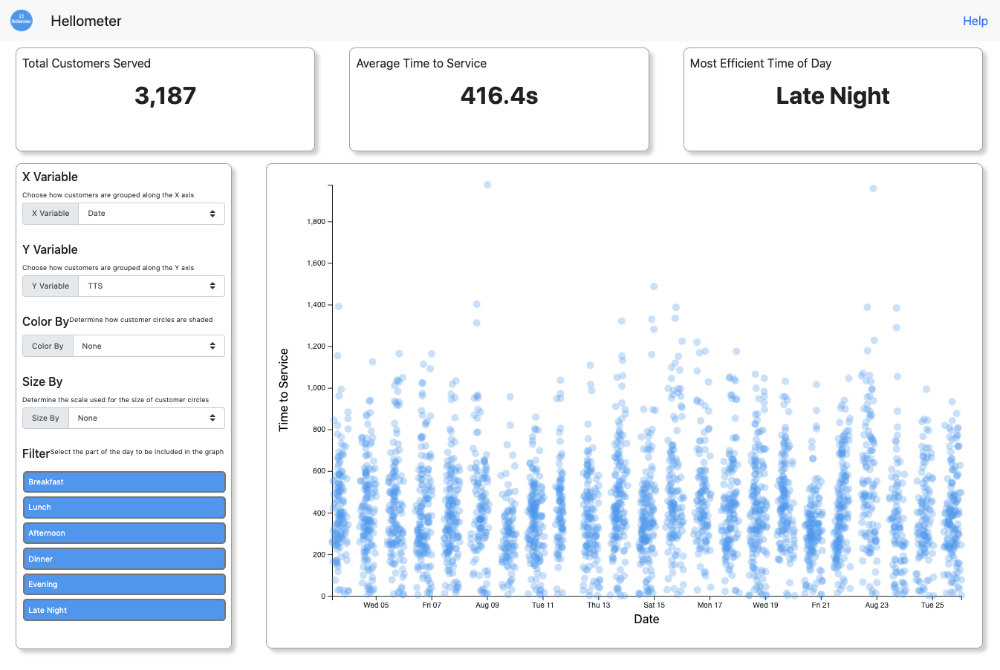

# Hellometer-Demo

Thank you for checking out my Hellometer demo code! This readme will quickly walk through: 
- [Submission Format](#submission-format)
- [How to "run" yourself](#open-the-dashboard)
- [How the code is structured](#code-structure)
- [Parting Thoughts](#parting-thoughts)

## Submission Format
For the main product I decided to go with a web-app style dashboard. To keep it exceedingly simple and ensure 
that anyone would be able to quickly open it and paly around, it is *pure front-end* HTML, CSS, JS based, i.e., there 
is no server of any kinds (no Node.js, no flask, no Django) required. This is limiting in that I can't use nice
data processing packages that we find in Python, and I am forced to deal with the data all at once (as a browser
isn't allowed to directly read and write files), so this is about as much data as I could handle without needing
to get clever with the visualizations (start thinking about Canvas) or chunk the data with a server. 

While the dashboard is the main submission. I did also quickly toss together a Jupyter Notebook to take a look at the 
data before I got started. I also used it to convert the data from a csv file to a JSON and save it in a .js file
so I could just load it into the dashboard. 

## Open the Dashboard
If you clone the repo, all you have  to do is open the `index.html` file with your browser. I *highly* recommend using Google Chrome,
as that is what I used while developing. Other browsers will likely work (Safari is good, and Edge is surprisingly good) but older browsers
do not always follow the same styling conventions. So, when developing a web-app for real its important to test on multiple platforms, but 
for this short assignment I didn't have time. 

If you do not clone, and rather download the zip, just make sure that you *unzip first* otherwise the browsers will not
be able to access the .css and .js files, so while something will show up, it will not look like the above image. 

Hopefully, once you have opening the dashboard it is pretty self-explanitory. The KPIs at the top are static. The scatter plot interacts with
the control panel. You can change the variable shown on the X and Y axis, as well as change how the circles are sized and colored. 
At the bottom of the control panel there is a multi-select filter. By default all periods of the day are selected. Simplying
clicking on one will toggle the selection. All updates are submitted automaticall. 

If you ever get confussed just hit the **Help button in the top right** of the toolbar. 

## Code Structure
The HTML shell is in `index.html` this is also where the imports for the libraries, stylesheets, and widgets are. The bottom of this file
has the imports for the data file, as well as an import for the `main.js` script. In a larger project this would be a more substantial file,
but here `main` is rather small. It handles some basic processing of the dates, initializes the widgets, and has a trivial update function. 

The logic for th KPIs is in the `kpiHelpers.js` file in the `Helpers` directory. Realistically, it would have been a lot faster
to come up with these stats with 2 or 3 lines of Python and pass them to the web-app, but I thought it would be kinda
neat to do it *all* with JavaScript. 

The scatter plot and the control panel both get their own JavaScript Prototypes, which are in their own files in the `Widgets` directory.
For the most part they follow the same basic format. Thar are initialized with a dictionary of parameters, and build some HTML scaffolding
then begin building out the dynamic elements. I like doing it this way as if I want to reuse a widget (e.g., a simple bar chart widget)
it is very easy to just re-instantiate with new data. To alleviate the need for these two widgets to talk directly with each other, they
instead call a global `update` function in `main` that sends out the commands. Here, that is trivial, as there is only uni-directional
communication from the control pane to the scatter plot. 

## Parting Thoughts
This was a very open ended "problem" and that data was pretty simple, so I thought it would be fun to make a really basic 
tool where a customer could go in and poke around the data themselves looking for patterns and insights. This is certainly
a long way from a finished product, but I think it is a good start. Next steps (apart from cleaning it up and making it prettier) 
would be to layer in recommendations and analytics. Riht now, you can look at the dots (esp. when grouped by period) and see the average
TTS and a distribution, but adding things like real histograms, a box plot, trend lines, etc. would make this a really powerful
tool for customers. 

Thank you again for taking a look at this. Please reach out if you have any questions or issues!
